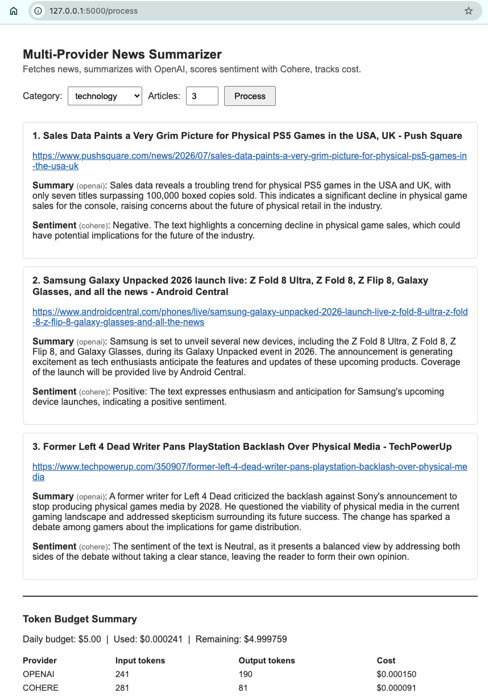

# Lab Proof

**Workflow:** NewsAPI fetches an article, OpenAI summarizes it, Cohere scores its sentiment, cost is tracked per request. Run with `python main.py` (CLI) or `python app.py` (web UI at `http://127.0.0.1:5000`).

## Execution trace

```
Fetching and processing 3 'technology' article(s)...

Trying openai (primary)...
[openai] 81 in + 52 out tokens = $0.000043 ($5.0000 remaining)
openai succeeded
Trying cohere (primary)...
[cohere] 86 in + 31 out tokens = $0.000031 ($4.9999 remaining)
cohere succeeded

1. The New Mercedes-Maybach GLS Debuts With More Power, Better Style - Motor1.com
   URL:               https://www.motor1.com/news/802238/2027-mercedes-maybach-gls-680-engine-specs-details/
   Summary (openai):  Mercedes-Benz has introduced the 2027 Maybach GLS 680, featuring a more
                       powerful twin-turbocharged V8 engine and a refreshed design.
   Sentiment (cohere): Positive: The text expresses enthusiasm for the new Mercedes-Benz model,
                        highlighting its improved performance and design.

TOKEN BUDGET SUMMARY: Used $0.000230 of $5.00, OPENAI 383 tokens / $0.000137, COHERE 353 tokens / $0.000093
```

Full run of 3 articles: [main_output.txt](main_output.txt)

## Input

```json
{
  "title": "The New Mercedes-Maybach GLS Debuts With More Power, Better Style - Motor1.com",
  "url": "https://www.motor1.com/news/802238/2027-mercedes-maybach-gls-680-engine-specs-details/"
}
```

## Output

```json
{
  "title": "The New Mercedes-Maybach GLS Debuts With More Power, Better Style - Motor1.com",
  "summary": "Mercedes-Benz has introduced the 2027 Maybach GLS 680, featuring a more powerful twin-turbocharged V8 engine and a refreshed design. The luxury SUV combines enhanced performance with improved aesthetics, maintaining its status as a premium offering in the automotive market.",
  "summary_provider": "openai",
  "sentiment": "Positive: The text expresses enthusiasm for the new Mercedes-Benz model, highlighting its improved performance and design, which indicates a favorable review and a positive sentiment.",
  "sentiment_provider": "cohere"
}
```

## Web UI (stretch goal)

`app.py` wraps the same `NewsSummarizer` pipeline in a one-page Flask form: pick a category and article count, submit, see results and a running cost summary rendered on the page. Same fetch, summarize, sentiment, and cost logic as the CLI above, just a browser front end instead of terminal prompts.


